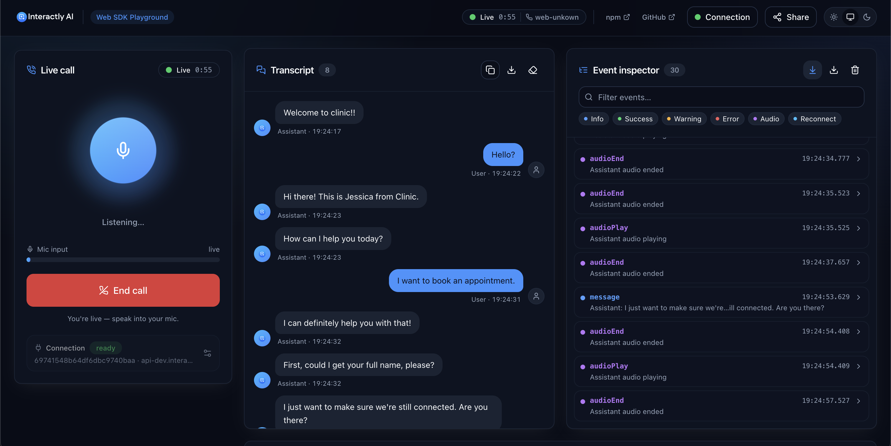

# Interactly AI · Web SDK Playground

A polished, modern playground for the [`@interactly-ai/web`](https://www.npmjs.com/package/@interactly-ai/web)
voice‑call SDK. Paste your credentials, place a **real browser voice call** to an
Interactly assistant, and watch the whole thing live: transcript, an audio
visualizer, **every SDK event** with full payloads, the assistant config, and
friendly handling of every error path. Configurations are **shareable via URL**.

Runs entirely in the browser — no backend. Your credentials are sent only to the
server URL you configure.

**🔗 Live demo:** _coming soon_ <!-- TODO: replace with the deployed URL once decided -->



## Quick start

```bash
npm install
npm run dev          # → https://local.interactly.ai:3000
```

The dev server is configured (in `vite.config.ts`) to serve at
**`https://local.interactly.ai:3000`** so the page origin matches the host that
the local Interactly backend allow-lists.

**Prerequisites**

- **Hosts entry** — `local.interactly.ai` must resolve to localhost. Add to
  `/etc/hosts`:
  ```
  127.0.0.1   local.interactly.ai
  ```
- **Certificate** — HTTPS uses an auto-generated self-signed cert, so the first
  visit shows a browser warning. Open `https://local.interactly.ai:3000` and
  accept it once. It's still a secure context, so the mic works. (For a
  warning-free cert, use [mkcert](#trusted-cert-with-mkcert-optional).)

Open the app at **`https://local.interactly.ai:3000`** (not `localhost` — that
host isn't allow-listed by the dev server). Then in the UI:

1. Paste your **API token**.
2. Set the **Server URL** — the Interactly **backend** the SDK calls (default
   `https://api.interactly.ai`; point it at your local/staging backend as needed).
3. Enter an **Assistant ID**.
4. Click **Start call** and allow microphone access.

> Change the dev host/port in `vite.config.ts` → `server.host` / `server.port`
> (and `server.allowedHosts`).

### Trusted cert with mkcert (optional)

To avoid the self-signed warning, generate a locally-trusted cert and let Vite use it:

```bash
brew install mkcert && mkcert -install
mkcert local.interactly.ai          # writes local.interactly.ai.pem + -key.pem
```

Then replace `basicSsl()` in `vite.config.ts` with a `server.https` block pointing
at those files:

```ts
import { readFileSync } from "node:fs";
// plugins: [react()],   // drop basicSsl()
server: {
  host: "local.interactly.ai",
  port: 3000,
  https: {
    cert: readFileSync("./local.interactly.ai.pem"),
    key: readFileSync("./local.interactly.ai-key.pem"),
  },
},
```

## Scripts

| Script            | What it does                                  |
| ----------------- | --------------------------------------------- |
| `npm run dev`     | Vite dev server with HMR                      |
| `npm run build`   | Type‑check + production build → `dist/`       |
| `npm run preview` | Serve the production build locally            |
| `npm run typecheck` | `tsc --noEmit`                              |

## Deploy

The build output in `dist/` is fully static — drop it on Vercel, Netlify,
Cloudflare Pages, GitHub Pages, or S3+CloudFront.

> **HTTPS is required in production.** `getUserMedia` (microphone) only works in a
> secure context (HTTPS or `localhost`). All the hosts above serve HTTPS.

For sub‑path hosting set `base` in `vite.config.ts`.

## Sharing & the API token

- Non‑secret settings (server URL, assistant ID) are encoded into the URL
  **hash** so a link reproduces the setup. The hash never reaches a server or its
  logs.
- The **API token is a secret and is excluded from share links by default.** The
  Share dialog has an explicit, off‑by‑default *"Include API token"* switch with a
  warning. If a link ever arrives carrying a token, a banner offers to remove it
  from the URL.
- Optionally, *"Remember token on this device"* persists the token to
  `localStorage` (off by default).

## What it exercises

- **Live call** — start/stop with a clear status machine (idle → connecting →
  live → ended/error), call timer, and the caller number from `call-start`.
- **Audio visualizer** — a reactive orb + mic meter driven by our own
  `AnalyserNode` tapped onto the SDK's stream, plus an "assistant speaking" state
  from `audioPlay`/`audioEnd`.
- **Transcript** — chat bubbles from `message` events, auto‑scroll, copy/export.
  Each call starts fresh (the previous transcript and log clear on a new start).
- **Event inspector** — every SDK event, color‑coded by severity, filterable, with
  expandable JSON payloads and JSON export. `recording` and `summary` events still
  appear here even though they aren't surfaced as dedicated panels.
- **Assistant config** — the assistant configuration the server sends, with a
  raw‑JSON view.
- **Onboarding** — a Connection dialog opens on first load when nothing is
  configured, and is reachable any time from the header / call console.

## Verifying a live call (manual checklist)

1. Toggle light/dark — the wordmark flips color, the icon keeps its blue
   gradient, and all text stays readable (everything is token‑driven).
2. **Negative paths:** clear the server URL → Start is disabled; use a bad token →
   the socket closes during setup and you get an "Authentication failed" message;
   deny the mic prompt → a "Microphone blocked" error with a Retry.
3. **Happy path:** with a real token + assistant ID, Start → allow mic → on
   `call-start` the status goes **Live** and the timer runs. Speak → the orb/meter
   react; the assistant replies → transcript fills and the orb blooms; every event
   appears in the inspector. Stop → status **Ended** (transcript + log stay for
   review); the assistant config renders if the server sent it.
4. Start again → the previous transcript and event log clear; the new call begins
   from a clean slate.
5. Copy a share link (token omitted by default) and open it — the non‑secret
   config repopulates.

## Notes on `@interactly-ai/web` v1.1.0

This playground integrates the **published** package. The SDK ships as untyped
CommonJS and has a few real quirks that this app handles deliberately (and
documents in `src/lib/interactly.d.ts` + `src/hooks/useInteractly.ts`):

- **Correct import** is the named export: `import { Interactly } from '@interactly-ai/web'`
  (the README's default import and `@interaclty-ai` spelling are typos).
- **`recording` and `summary` events** are emitted by the SDK but their keys are
  missing from its internal handler map, so `on('recording' | 'summary')` is a
  no‑op as shipped. The hook patches `instance.eventHandlers.recording/summary`
  before registering, so those events fire and show up in the event inspector.
- **Automatic reconnect is inert** (the internal `reconnect()` calls are commented
  out), so the playground intentionally doesn't surface a reconnect control. Any
  reconnect events the SDK does emit still appear in the event inspector.
- **An invalid/expired token doesn't throw** — the session fetch fails silently
  and the socket connects with `token=null`, then closes. We detect "closed
  before `call-start`" and surface it as an authentication failure.
- The SDK always captures the **system‑default** microphone
  (`getUserMedia({ audio: true })`), so the mic panel is an informational status
  readout rather than a device selector.

## Tech

Vite · React 18 · TypeScript · Tailwind CSS (CSS‑variable design tokens, full
dark/light) · Radix UI primitives (shadcn‑style) · Framer Motion · lucide‑react ·
sonner.

## Project layout

```
src/
├─ lib/         interactly.d.ts (ambient SDK types), domain types, url-state,
│               error-map, validation, secure-context, format helpers
├─ hooks/       useInteractly (core lifecycle), useUrlState, useMicAnalyser,
│               useMediaDevices, useCallTimer, useTheme
├─ providers/   ThemeProvider (class strategy, no flash, localStorage + system)
└─ components/  ui/ (primitives), branding/, layout/, config/, call/,
                visualizer/, transcript/, events/, artifacts/, common/
```
